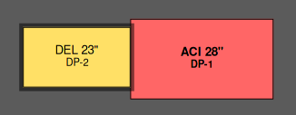
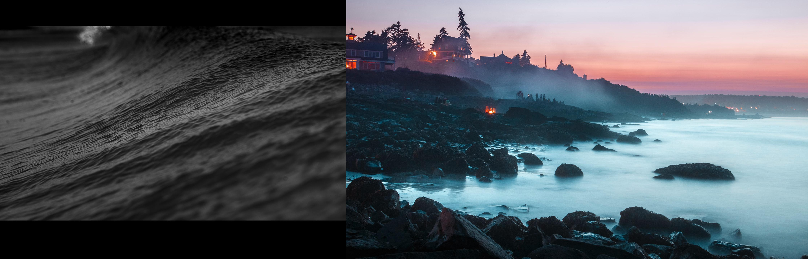

# Gnome Random Wallpaper

A simple program that sets random wallpaper images as desktop backgrounds in Gnome based window managers. It fetches images from a local directory or Unsplash, composes a new image to match display size and arrangement, and sets the new image as the desktop background.

Example arrangement:


Example wallpaper:


## Usage

Gnome Random Wallpaper (`grw`) currently makes the following assumptions about the user:
* The user will configure some external scheduler to prompt the `grw` command to run in the background
* The user doesn't want to keep the generated wallpaper images forever
  * The last image to be generated is replaced by the new image
  * The output directory is `/tmp/random` - `/tmp` is commonly a tmpfs filesystem and exists only in memory (while the system remains on)
* The user won't change configuration or interact directly with the program often, making command line argument support a low priority

Simply running `grw` will fetch images from either the [Unsplash API](https://source.unsplash.com/) or the directory you've defined and update your desktop background.

Some key steps to take in your environment:
* Configure a cron job or timer of some sort to run `grw` at regular intervals (every 15 minutes works well for me - `*/15 * * * * /path/to/grw`)
* Configure a Startup Application to run `grw` on login

## Installation

Install with pip using a command like:
```
pip install git+https://github.com/miliarch/gnome_random_wallpaper.git
```

After installation, a `grw` link should land in your `$HOME/.local/bin` directory (this may vary depending on distro - it's accurate for Arch Linux). If this directory is in your path, the `grw` command should work without issue. Otherwise, you'll need to specify the full path.

Alternatively, clone this repository to your preferred installation directory and manually link `./gnome_random_wallpaper/gnome_wallpaper.py` in the execution directory of your choice.

## Configuration

Default configuration can be found in [gnome_random_wallpaper/config.yaml](gnome_random_wallpaper/config.yaml). This file can be copied to `$HOME/.config/gnome_random_wallpaper/config.yaml` and modified to override the defaults.

## Supported display configurations

Any number of displays that are arranged horizontally (side-by-side) within the vertical (height) bounds of the largest display should be supported.

## Unsupported display configurations

Vertical arrangements, including mixed vertical/horizontal arrangements, are currently unsupported. Support may be implemented in the future.

## Tested configurations

### Window managers

* Cinnamon 5.0.5

### Resolutions
* 1920x1080
* 2560x1440
* 3840x2160

### Display arrangements
* Dual monitor, landscape orientation, horizontal arrangement (side-by-side)
